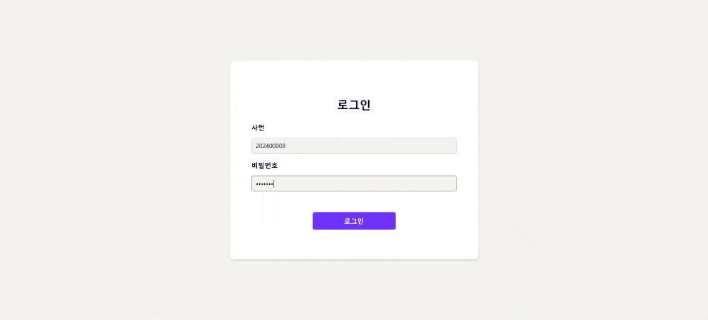
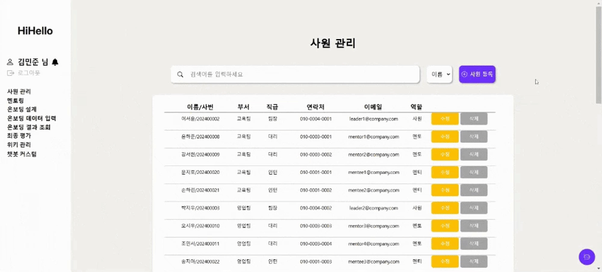
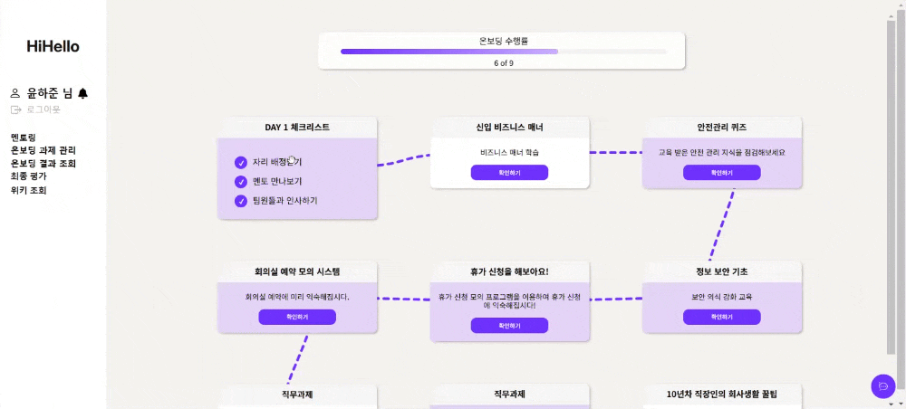
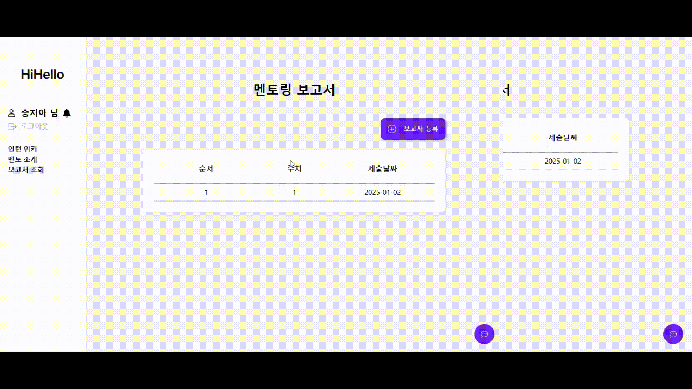

<h1 align="center" style="border-bottom: none;">HiHello
<h3 align="center">채용 전환형 인턴을 위한 온보딩 시스템 
Onboarding System for Intern-to-Full-Time Transition</h3></h1>

||
:-:|
|김태영 [@wildcat222](https://github.com/wildcat222)|

  
프로젝트 개요

  

    

     
    
>[프로젝트 기획서](https://docs.google.com/document/d/10-rBIVVxRV5bcQZF-zKqIN9KAENM4mPXSNmPdMm0b8U/edit?tab=t.0)
    

  

  
요구사항 명세서

  

   

  >[요구사항 명세서 링크](https://docs.google.com/spreadsheets/d/1F-cg6s2nEanYSHGntDhI2j4zHp84mA0LCy3uGkZ1FhE/edit?usp=sharing)

  

  
REST API 설계 문서

  

   

  >[REST API 설계 문서 링크](https://docs.google.com/spreadsheets/d/1Q5mAK7DpkkMOAeIJh1vDpDNL0JCxNqVo04mbXbr1T1Y/edit?gid=900731616#gid=900731616)

  

## 🎯 기술 스택

### 💻 Backend

### 💾 Database

### 🔧 Development

### 🎨 Frontend

## 📌 담당 기능
1. Jpa, Mybatis를 사용한 CRUD 
 - 회원 정보 관리 기능 
 - 멘토링 보고서 관리 기능 
2. Spring Security를 적용하여 사용자 인증 및 권한 관리 
3. Redis를 활용한 JWT token 관리 및 인증/인가 관리 
4. SSE를 통한 실시간 알림 기능 
5. Prometheus와 Grafana를 활용하여 시스템 성능 및 리소스 
모니터링, 대시보드를 통해 실시간 데이터 시각화 
6. Vue.js Composition Api 방식을 통해 클라이언트와 서버 API 연동 
및 회원 관리, 멘토링 보고서 관리 페이지 구성 
7. Pinia를 활용하여 데이터 흐름 관리 및 상태 동기화

 

  
담당자 - 회원 
 
  
  로그인
  

  사원 추가
  

  사원 수정
  

  사원 삭제
  

  비밀번호 변경
  

  
멘토링 보고서
 

  멘토링 보고서 조회, 작성, 피드백 작성
  

  
실시간 알림
 

  

